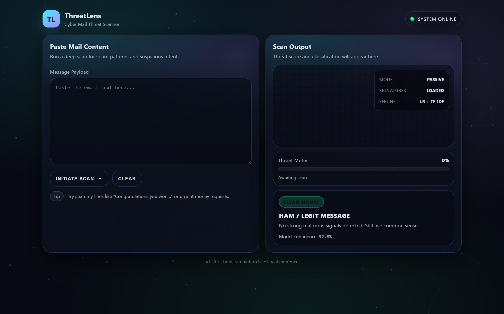

# Email_Spam_Classification (ThreatLens)

A cyber-themed Flask web app that classifies email text as **SPAM** or **HAM** using a trained **Logistic Regression + TF-IDF** model.
Paste any email content, hit **INITIATE SCAN**, and get a clean “threat scan” style result with confidence.

---

## Demo UI

## UI Preview



* Neon cyber dashboard
* Scan overlay animation
* Threat meter + confidence
* Clear classification output (SPAM / HAM)

---

## Tech Stack

* **Python**
* **Flask**
* **scikit-learn** (Logistic Regression)
* **TF-IDF Vectorizer**
* **HTML/CSS/JS** (custom cyber UI)

---

## Project Structure

```
Email_Spam_Classification/
  app.py
  logistic_regression.pkl
  feature_extraction.pkl
  templates/
    index.html
  static/
    app.js
    styles.css
```

---

## Setup & Run (Windows)

### 1) Go to project folder

PowerShell:

```powershell
cd "D:\spam or ham"
```

### 2) Create venv (if not already)

```powershell
python -m venv venv
```

### 3) Install dependencies

```powershell
.\venv\Scripts\python.exe -m pip install --upgrade pip
.\venv\Scripts\python.exe -m pip install flask scikit-learn numpy scipy
```

### 4) Run the app

```powershell
.\venv\Scripts\python.exe app.py
```

Open in browser:

* `http://127.0.0.1:5000`

---

## Setup & Run (macOS / Linux)

```bash
python3 -m venv venv
source venv/bin/activate
pip install --upgrade pip
pip install flask scikit-learn numpy scipy
python app.py
```

---

## How It Works

1. User pastes email text in the UI.
2. Text is transformed using **TF-IDF Vectorizer** (`feature_extraction.pkl`).
3. **Logistic Regression** model (`logistic_regression.pkl`) predicts:

   * `0` → **SPAM**
   * `1` → **HAM**
4. If available, the app also shows probability-based **confidence**.

---

## Notes

* Keep `logistic_regression.pkl` and `feature_extraction.pkl` in the same folder as `app.py`.
* UI assets must stay inside `static/` and HTML must stay in `templates/`.

---

## GitHub Upload Tips

### Recommended `.gitignore`

```gitignore
__pycache__/
*.pyc
venv/
.vscode/
.DS_Store
Thumbs.db
```

(Optional) If you don’t want to upload trained model files:

```gitignore
*.pkl
```

---

## Future Improvements

* Highlight suspicious keywords / links in the email text
* Add phishing URL detection + domain reputation checks
* Store scan history (SQLite)
* Deploy to Render / Railway / Azure App Service

---

## License

MIT (or choose your own)
